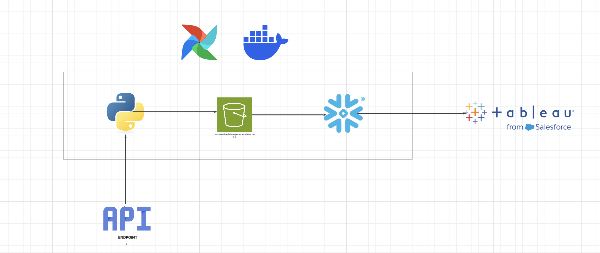
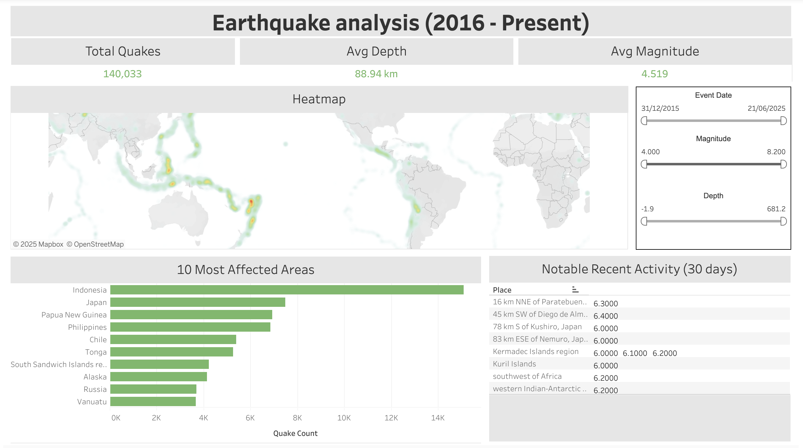
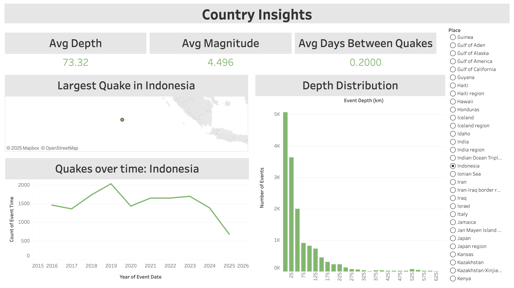

# Earthquake-Pipeline
## Overview
Earthquake Data Pipeline is an end-to-end data engineering project that automates the ingestion, transformation, and visualization of global earthquake data. Using Amazon S3 for storage, Apache Airflow (via Astronomer) for orchestration and Snowflake as the data warehouse, the pipeline extracts raw data from the USGS API and prepares it for analysis. Processed data is visualized in Tableau, enabling interactive dashboards that reveal trends in seismic activity, such as magnitude, frequency, and regional impact.

## The Dataset & Insights
The USGS Earthquake Catalog API provides worldwide historical earthquake data, for this project we will be pulling data from the last 10 years, updating daily.
The API contains key earthquake details such as magnitude, location, depth, time of occurence and more.

This project will seek to uncoveer key insights such as:
- A global heatmap using historical data to find quake hotspots.
- Historical analysis such as average depth, magnitude and the most affected regions.
- Country specific insights such as earthquake trends over the years and much more.

## Tools Used
- Amazon AWS
- Amazon S3
- Snowflake
- Tableau
- Apache Airflow (using Astronomer)
- SQL
- Python
- Git

## Project Architecture

## Dashboards

Historical Analysis:
[Historical Dashboard](https://public.tableau.com/app/profile/corey.franks/viz/Earthquake-visualizations-historical/Earthquakeanalysis2016-Present)

Country-specific insights:
[Countries Dashboard](https://public.tableau.com/app/profile/corey.franks/viz/Earthquake-visualizations-Countries/CountryInsights)

